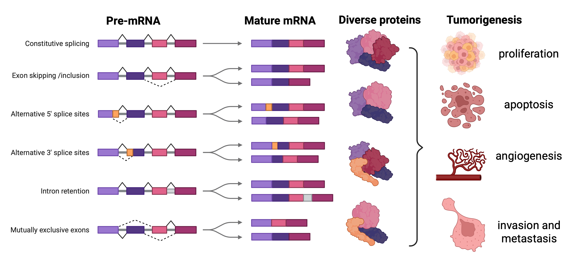
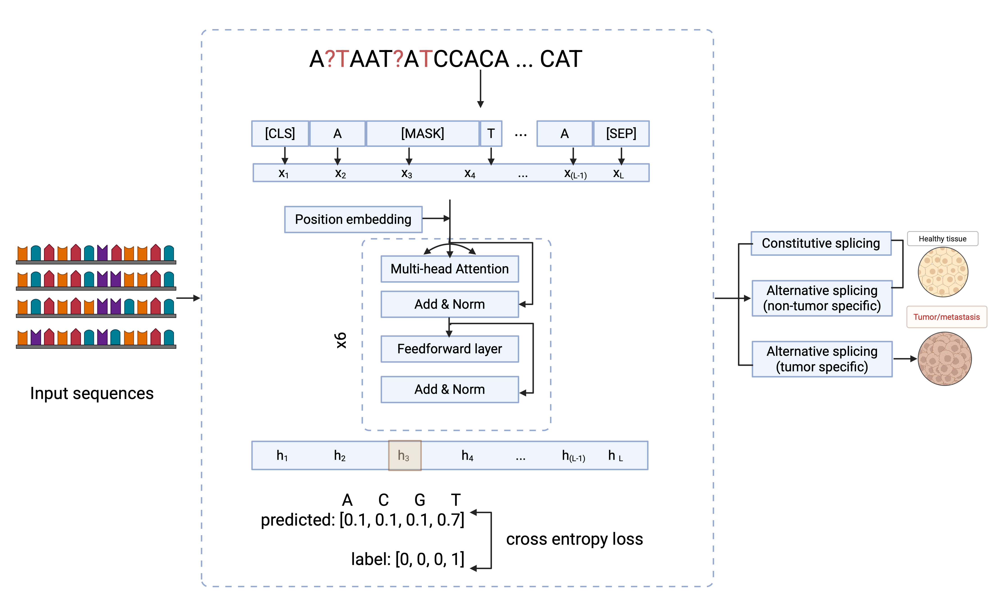

# Team6_LLM_Splicing_Studies

## Introduction

Alternative splicing (AS) is a critical regulatory mechanism in eukaryotic gene expression, allowing a single gene to produce multiple transcript variants and protein isoforms. This process significantly contributes to proteome diversity and plays a crucial role in cellular differentiation, tissue-specific gene expression, and disease development, including cancer. AS events include constitutive splicing, exon skipping, alternative 5' and 3' splice sites, intron retention, and mutually exclusive exons, as illustrated in the figure below.

Dysregulation of AS is frequently associated with tumorigenesis, influencing cancer hallmarks such as proliferation, apoptosis, angiogenesis, invasion, and metastasis. Understanding the regulation and prediction of AS is essential for developing targeted therapies and biomarkers.

## Data Processing

The data processing pipeline for this project involves multiple steps to ensure high-quality training and evaluation data:

- **Data Acquisition and Preprocessing**: Collect tumor splicing event data, including transcript sequences and splicing annotations.
- **Filtering**: Remove low-confidence events based on PSI (Percent Spliced In) thresholds to retain significant splicing events.
- **DNA Sequence Extraction**: Extract corresponding DNA sequences from the reference genome based on identified splice sites.
- **One-Hot Encoding**: Convert DNA sequences into numerical representations suitable for LLM input.
- **Dataset Splitting**: Divide the data into training, validation, and testing sets for robust model evaluation.

## Model Description
The model used for this project is based on a large language model (LLM) architecture inspired by SpliceBERT, pre-trained on extensive RNA sequence data. It is designed to predict alternative splicing sites and differentiate between constitutive and alternative splicing events. The architecture includes the following components:

- **Tokenization**: Input RNA sequences are tokenized with position embeddings to capture sequence context.
- **Transformer Encoder**: The core model uses multiple transformer layers, each containing multi-head self-attention, layer normalization, and feed-forward networks to learn complex sequence dependencies.
- **Classification**: The output layer predicts the probability of each nucleotide being part of a constitutive or alternative splice site.

### Key Features
- Supports constitutive splicing, alternative splicing (tumor-specific and non-tumor-specific), and intron retention prediction.
- Fine-tuned for splicing site detection in healthy and tumor tissues.
- Outputs include splice site probability scores and cross-entropy loss for training optimization.
