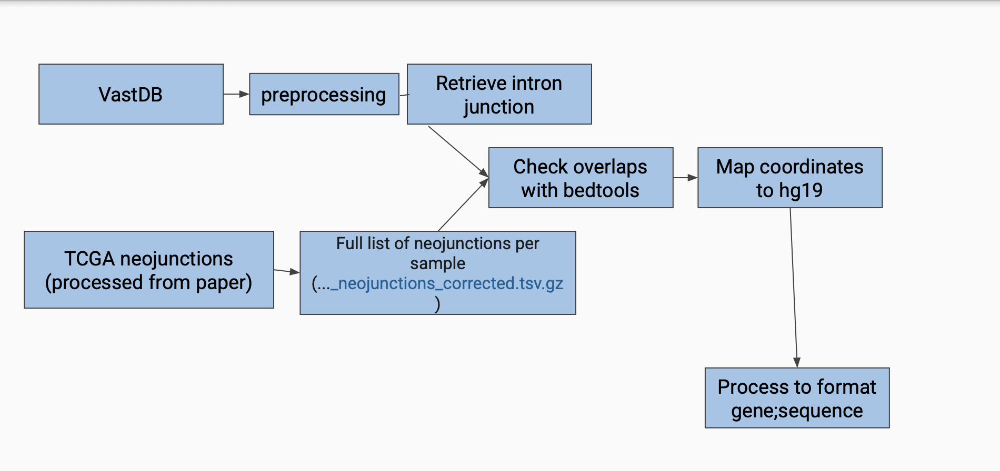
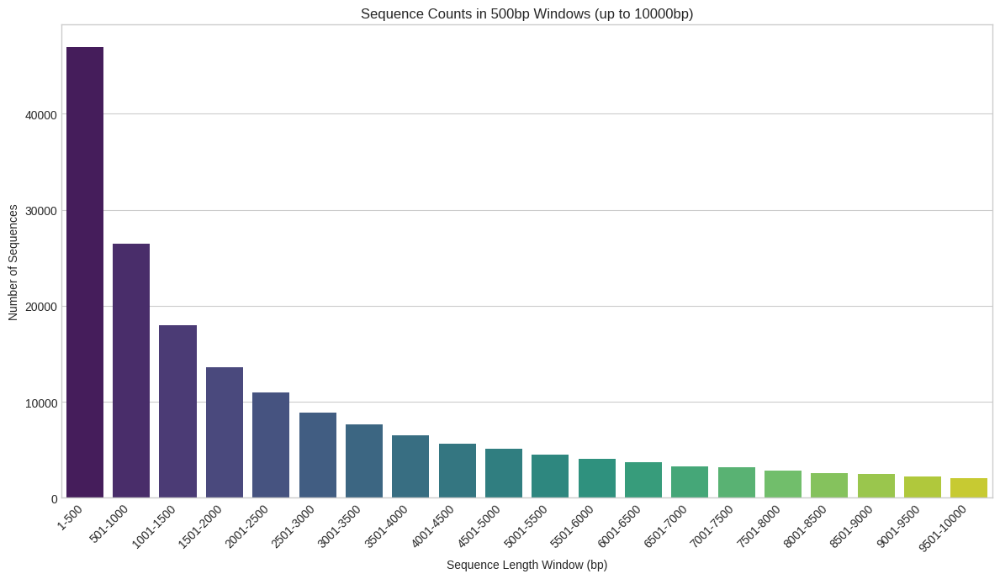

# Team6_LLM_Splicing_Studies

## Introduction & Background

Alternative splicing (AS) is a critical regulatory mechanism in eukaryotic gene expression, allowing a single gene to produce multiple transcript variants and protein isoforms. This process significantly contributes to proteome diversity and plays a crucial role in cellular differentiation, tissue-specific gene expression, and disease development, including cancer. AS events include constitutive splicing, exon skipping, alternative 5' and 3' splice sites, intron retention, and mutually exclusive exons, as illustrated in the figure below.

Dysregulation of AS is frequently associated with tumorigenesis, influencing cancer hallmarks such as proliferation, apoptosis, angiogenesis, invasion, and metastasis. Understanding the regulation and prediction of AS is essential for developing targeted therapies and biomarkers.

## Objective

The idea is to train an LLM model for distinguishing RNA sequences that give rise to neojunctions, in cancerous tissues, from sequences that correspond to canonical splicing junctions, found in normal tissues. 

## Data
- TCGA (specifcally tss_complexity_counts.whitelisted.G0.01.globsum20.filtLib.conf3_neojunctions_corrected.tsv.gz) https://gdc.cancer.gov/about-data/publications/PanCanAtlas-Splicing-2018
- VastDB https://vastdb.crg.eu/wiki/Downloads#AS_events
- hg19 
## Data Processing

The data processing pipeline for this project involves multiple steps to ensure high-quality training and evaluation data:

- **Data Acquisition and Preprocessing**: Collect tumor splicing event data, including transcript sequences and splicing annotations.
- **Filtering**: Remove low-confidence events based on PSI (Percent Spliced In) thresholds to retain significant splicing events. (TODO)
- **DNA Sequence Extraction**: Extract corresponding DNA sequences from the reference genome based on identified splice sites.
- **One-Hot Encoding**: Convert DNA sequences into numerical representations suitable for LLM input.
- **Dataset Splitting**: Divide the data into training, validation, and testing sets for robust model evaluation.

## Why we have chosen only junctions consisting only from introns and not windowed entire splicing event?

## Model
1. Inputs (A, B): You start with two text files:
    * Neojunction.txt: Contains sequences (or gene;sequence) representing tumor-associated neojunctions (Positive Class, Label 1).
    * Normal_junctions.txt: Contains sequences representing normal junctions (Negative Class, Label 0).
2. Data Loading & Preprocessing (C, D, E, F): This is handled by the Python script:
    * (D) Sequences are read from both files, and initial labels (1 for neo, 0 for normal) are assigned.
    * (E) If the number of sequences in either file exceeds MAX_SAMPLES_PER_CLASS (e.g., 50,000), the script randomly samples down to this limit for each class. This step is crucial for managing memory with very large input files.
    * (F) The (potentially sampled) positive and negative datasets are combined into a single dataset.
3. Data Splitting (G):
    * The combined dataset is split into a training set and a validation set. This split is typically stratified to maintain similar class proportions in both sets.
4. Training Set Resampling (H):
    * To address class imbalance (if one class has significantly more samples than the other after the initial sampling and splitting), the training set is resampled. This might involve oversampling the minority class or undersampling the majority class. The validation set (I) is kept with its original distribution to provide an unbiased evaluation.
5. Tokenization (J, K):
    * Both the resampled training sequences and the validation sequences are tokenized. This involves:
        * Converting the DNA strings (e.g., "AGCT...") into numerical representations (input IDs, attention masks) that the SpliceBERT model can understand.
        * Ensuring all sequences are padded or truncated to a fixed length (e.g., 510 bp for splicebert-510) as required by the model.
6. Pre-trained SpliceBERT Model (L):
    * You start with a SpliceBERT model that has been pre-trained on a large corpus of genomic DNA. This model has already learned general features of DNA sequences relevant to splicing.
7. Fine-Tuning (M):
    * The pre-trained SpliceBERT model (with an added classification head for binary output) is then fine-tuned using your prepared training dataset (J).
    * The Hugging Face Trainer handles the training loop, optimization, and uses the validation dataset (K) to monitor performance during training and potentially select the best model checkpoint.
8. Performance Metrics (N):
    * During and after fine-tuning, the model's performance is evaluated on the validation set using metrics like accuracy, F1-score, precision, recall, and AUC-ROC.
9. Output (O):
    * The result of this process is a fine-tuned SpliceBERT model. This model is now specialized to take a DNA sequence (representing a splice junction context) and classify it as either a "neojunction" or a "normal junction."

### Key Features
- Supports constitutive splicing, alternative splicing (tumor-specific and non-tumor-specific), and intron retention prediction.
- Fine-tuned for splicing site detection in healthy and tumor tissues.
- Outputs include splice site probability scores and cross-entropy loss for training optimization.

## Future directions
- Plotting and comparing attention weights to understand what parts of the input sequence the model "pays attention to" when making its classification (neojunction vs. normal junction). 
- Explore models that allow bigger windows
- Use sequences that have an "entire alternative splicing events"
